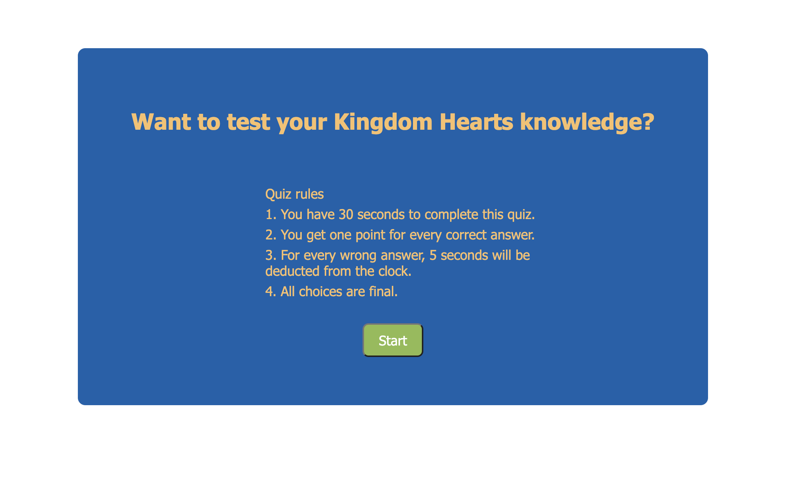

# Timed Quiz

## Description
Kingdom Hearts is a video game franchise that began in the early 2000s. This timed quiz is 10 questions

## How it works
When the user first opens the page, they are met with the starting screen. The starting screen explains the rules of the quiz which include how long they will have to complete it and what happens when they get an answer wrong.

When a user gets an answer wrong, 5 seconds is subtracted from the timer. When a user gets an answer right, they recieve a point. Upon completing the quiz, the user will be prompted with a way to save their score to their local server.

## Deployed Link 
https://lauraantunez024.github.io/CodeQuiz/

## Credits
This was created as part of an assignment for Georgia Tech Coding Bootcamp
